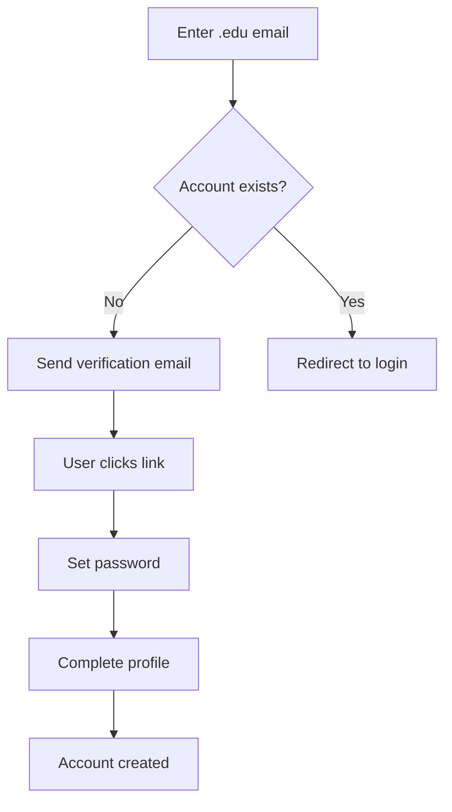
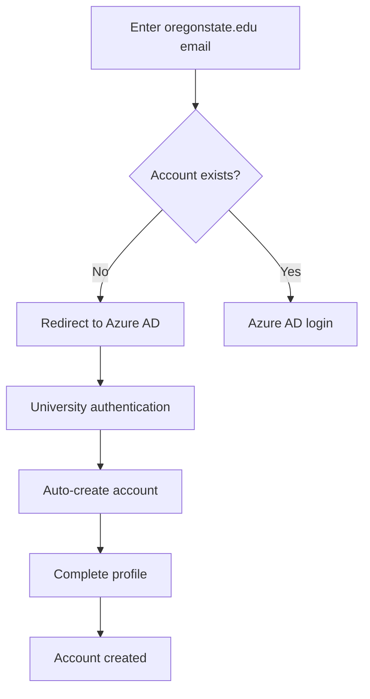
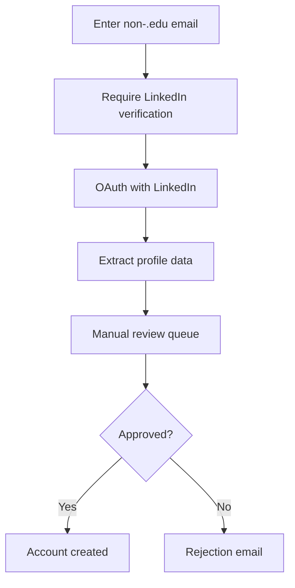
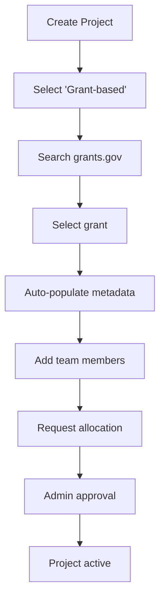
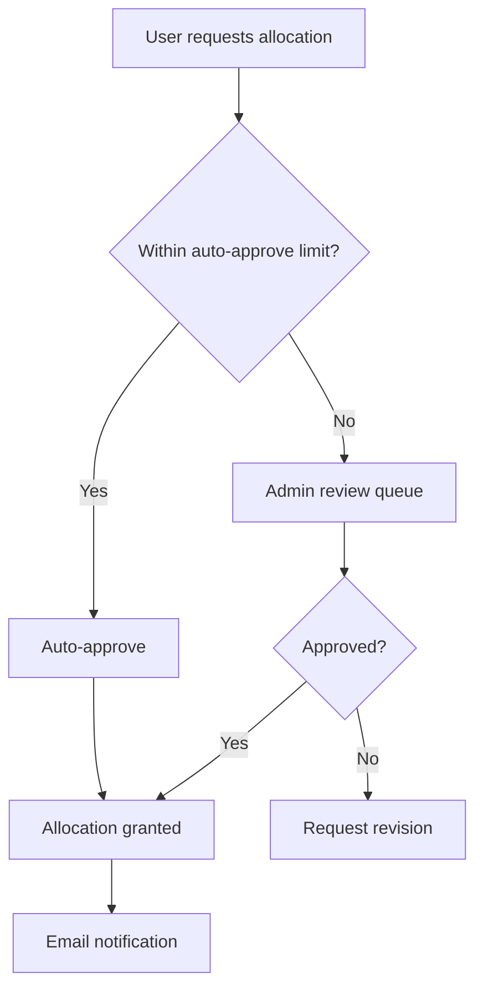
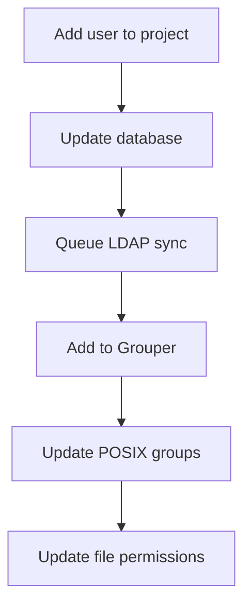
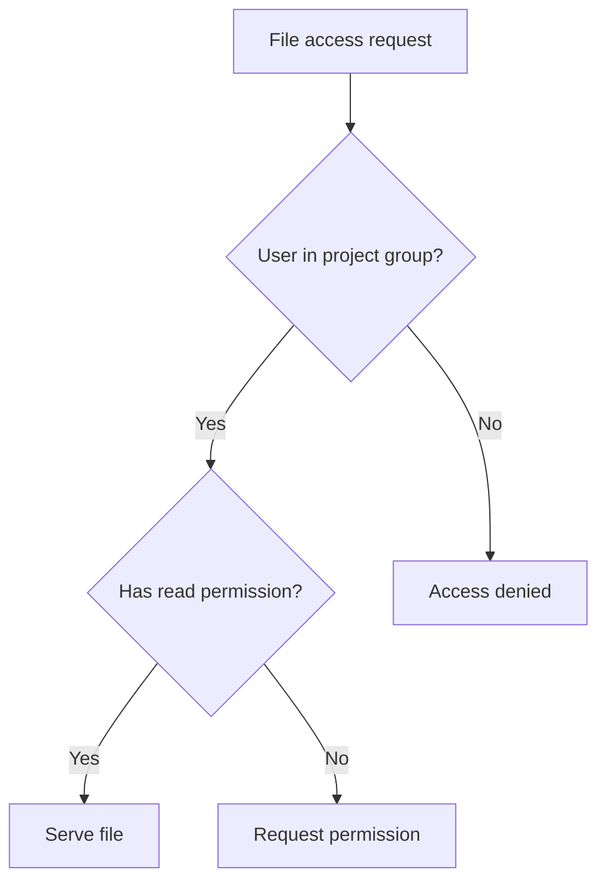
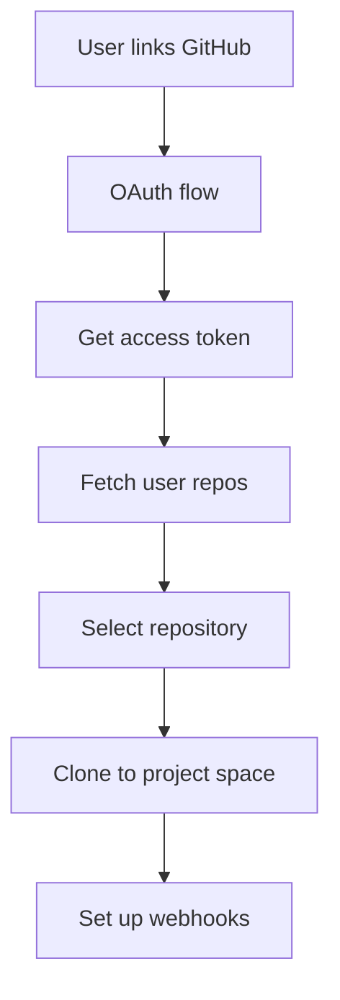
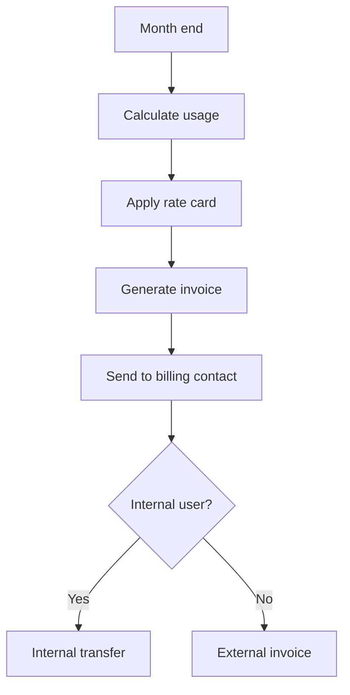
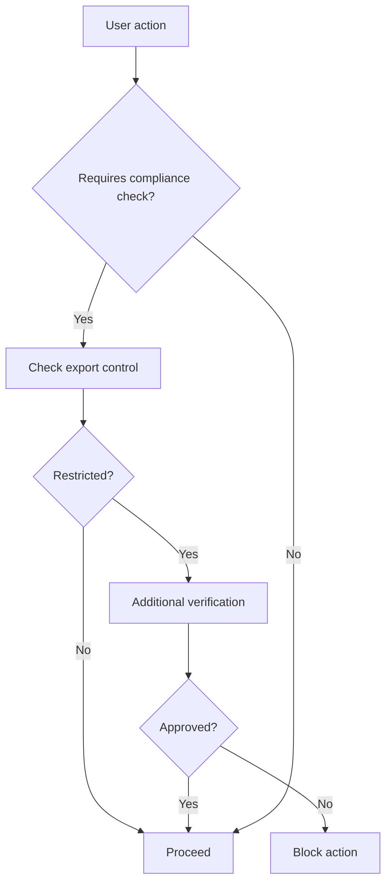

# User Workflows & Business Logic

## User Registration Flow

### External User (.edu email, non-federated)


### Internal User (federated university)


### Non-.edu User Registration


## Project Creation Workflow

### Creating a Woerk ID
1. **User initiates creation**
   - Must have verified email
   - Must have default billing info (for .edu users)

2. **System generates Woerk ID**
   ```
   Format: XX-YY (e.g., AB-12)
   - Globally unique
   - Random alphanumeric
   - Hyphen separator
   ```

3. **Automatic resource setup**
   - Create LDAP group: `project-AB12-users`
   - Create storage directory: `/projects/AB-12/`
   - Initialize default allocation

### Grant-Based Project


## Resource Allocation Logic

### Allocation Rules
1. **Maximum allocation**: 99% of total resource
2. **Minimum allocation**: 1 unit
3. **Default allocation**: Based on user role
   - Faculty: 100 GPU hours/month
   - Staff: 50 GPU hours/month
   - Student: 20 GPU hours/month

### Allocation Request Process


## Group Management Workflow

### Automatic Group Creation
When project "AB-12" is created:
1. Create `project-AB12-users` (all members)
2. Create `project-AB12-admins` (project owner)
3. Create `project-AB12-readonly` (optional)

### Group Synchronization


## File Management Workflow

### Upload Process
1. **Select target directory**
   - Only shows authorized directories
   - Based on project membership

2. **Upload validation**
   - File size limit: 10GB
   - Virus scan (if configured)
   - File type restrictions

3. **Storage routing**
   ```javascript
   if (file.size < 100MB) {
     store_in_database()
   } else if (file.type === 'dataset') {
     store_in_s3()
   } else {
     store_in_posix()
   }
   ```

### Access Control


## Terminal Access Workflow

### SSH Certificate Generation
1. **User requests terminal access**
2. **System validates**:
   - Active project membership
   - No security violations
   - Resource availability

3. **Certificate creation**:
   ```bash
   ssh-keygen -s ca_key -I user@project \
     -n user -V +8h \
     -O permit-pty \
     -O permit-port-forwarding \
     user_key.pub
   ```

4. **Connection established**:
   - WebSocket tunnel created
   - xterm.js initialized
   - Session logged for audit

## GitHub Integration Workflow

### Repository Linking


### Automated Workflows
1. **On push to main**:
   - Trigger CI/CD pipeline
   - Update project activity log
   - Notify team members

2. **On PR creation**:
   - Auto-assign reviewers
   - Check resource availability
   - Run preliminary tests

## Data Steward Hierarchy

### Inheritance Chain
```
University Data Steward
    └── Department Data Steward
        └── Project Data Steward
            └── Individual User
```

### Permission Cascade
1. **University level**: Full access to all university projects
2. **Department level**: Access to department projects
3. **Project level**: Access to specific project
4. **User level**: Access to own data only

### Data Steward Actions
- View all subordinate data
- Export audit logs
- Reassign ownership
- Emergency access revocation

## Billing & Usage Tracking

### Usage Calculation
```javascript
function calculateUsage(project) {
  const usage = {
    compute: sum(job.cpu_hours * job.node_count),
    storage: average(daily_storage_gb),
    gpu: sum(job.gpu_hours),
    transfer: sum(egress_gb)
  };
  
  return {
    ...usage,
    cost: calculateCost(usage, project.rate_card)
  };
}
```

### Billing Workflow


## Security & Compliance

### Email Verification Schedule
- Initial: On registration
- Regular: Every 90 days
- Trigger: On sensitive actions

### Audit Log Events
1. **Authentication**:
   - Login/logout
   - Failed attempts
   - Identity linking

2. **Authorization**:
   - Permission changes
   - Group modifications
   - Role assignments

3. **Resource Access**:
   - File uploads/downloads
   - Terminal sessions
   - API calls

4. **Administrative**:
   - Project creation/deletion
   - Allocation changes
   - User management

### Compliance Checks


## Notification System

### Email Notifications
1. **Immediate**:
   - Account verification
   - Password reset
   - Security alerts

2. **Daily Digest**:
   - Project activity
   - Pending approvals
   - Usage warnings

3. **Weekly Summary**:
   - Resource utilization
   - Team updates
   - System maintenance

### In-App Notifications
- Real-time via WebSocket
- Stored for 30 days
- Categories: Info, Warning, Error, Success

## Error Handling & Recovery

### Graceful Degradation
```javascript
try {
  await primaryService.call();
} catch (error) {
  if (fallbackAvailable) {
    await fallbackService.call();
  } else {
    queue_for_retry(request);
    return cached_response;
  }
}
```

### Retry Logic
1. **Immediate retry**: Network timeouts
2. **Exponential backoff**: Rate limits
3. **Queue for later**: Service unavailable
4. **Manual intervention**: Data conflicts

## Performance Optimization

### Caching Strategy
- **User sessions**: 15 minutes
- **Project data**: 5 minutes
- **File listings**: 1 minute
- **Grant searches**: 24 hours

### Database Queries
```sql
-- Optimized project list query
SELECT p.*, 
       COUNT(DISTINCT pm.user_id) as member_count,
       SUM(a.used) as total_usage
FROM projects p
LEFT JOIN project_members pm ON p.id = pm.project_id
LEFT JOIN allocations a ON p.id = a.project_id
WHERE p.owner_id = $1 OR pm.user_id = $1
GROUP BY p.id
ORDER BY p.created_at DESC
LIMIT 20 OFFSET $2;
```

### Load Balancing
- Frontend: CDN for static assets
- Backend: Multiple instances behind LB
- Database: Read replicas for queries
- Storage: Distributed file system